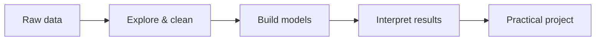

<div align="center">

# Hi, I'm Vedanshu 👋

### Data & machine learning enthusiast building practical, insight-driven projects.


<p>
  <a href="https://github.com/Vedanshu-co"></a>
  
  
</p>

</div>

```text
> whoami
Vedanshu Nakade — Data & Machine Learning

> focus
Machine Learning · Computer Vision · Exploratory Data Analysis

> toolkit
Python · Jupyter · Pandas · scikit-learn · OpenCV · Seaborn · Git
```

## About me

I'm focused on data analysis and machine-learning projects that turn real-world questions into useful insights. I enjoy exploring data, training practical models, and building clear, reproducible notebooks.

- 🌱 Exploring **machine learning, computer vision, and data analytics**
- 🔭 Building projects with **Python and Jupyter notebooks**
- 💬 Ask me about **data cleaning, exploratory analysis, and regression**

## Technical focus



- **Machine learning:** regression and model-based prediction
- **Computer vision:** face-recognition workflows with OpenCV and LBPH
- **Data analytics:** cleaning, visualization, pattern discovery, and reporting

## Skills & tools

<p>
  
  
  
  
  
  
  
  
</p>

## Selected work

| Project | What it does | Stack |
| --- | --- | --- |
| **[Placement Predictor](https://github.com/Vedanshu-co/placement-predictor)** | Predicts placement salaries using a linear-regression model. | `Python` · `scikit-learn` |
| **[Palm Gesture Attendance](https://github.com/Vedanshu-co/Attendance_system_with_Palm_Gesture_Triggered-machine-learning-AI)** | Uses palm gestures, OpenCV, and LBPH face recognition to record attendance. | `Python` · `OpenCV` |
| **[Amazon Product EDA](https://github.com/Vedanshu-co/EDA-1)** | Explores product listings to surface category, discount, price, and rating trends. | `Python` · `Pandas` · `Seaborn` |

## GitHub activity

<p>
  
  
</p>

<p>
  
</p>


---

<div align="center">
  <i>Open to learning, collaborating, and building useful things.</i>
</div>
